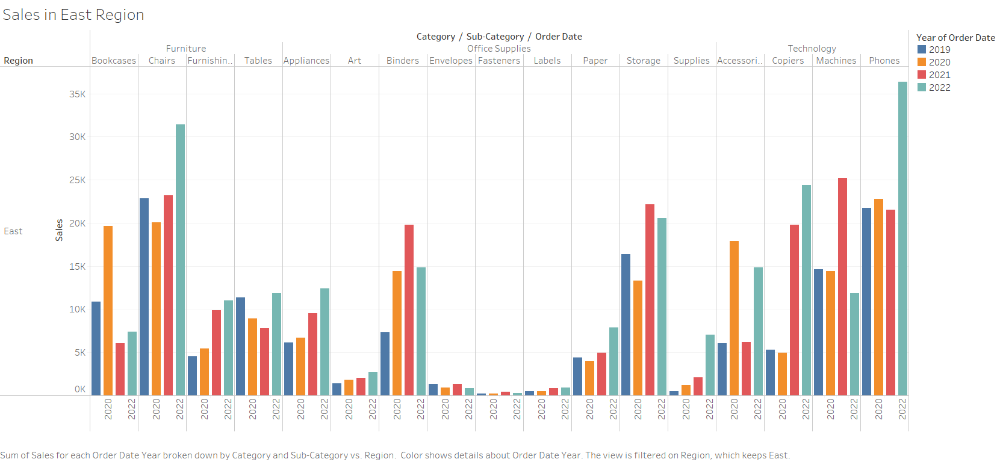

HW 1, CS 625, Spring 2023
================
Syamala Akhila Devi Bolla
Jan 19, 2023

## Git, GitHub

1.  *What is your GitHub username?* AkhilaBolla28

2.  *What is the URL of your remote GitHub repo (created through
    Mr. Kennedy’s exercises)?*
    <https://github.com/AkhilaBolla28/myrepo.git>

## R

The command below will load the tidyverse package. If you have installed
R, RStudio, and the tidyverse package, it should display a list of
loaded packages and their versions.

``` r
library(tidyverse)
```

    ## ── Attaching packages ─────────────────────────────────────── tidyverse 1.3.2 ──
    ## ✔ ggplot2 3.4.0      ✔ purrr   1.0.1 
    ## ✔ tibble  3.1.8      ✔ dplyr   1.0.10
    ## ✔ tidyr   1.2.1      ✔ stringr 1.5.0 
    ## ✔ readr   2.1.3      ✔ forcats 0.5.2 
    ## ── Conflicts ────────────────────────────────────────── tidyverse_conflicts() ──
    ## ✖ dplyr::filter() masks stats::filter()
    ## ✖ dplyr::lag()    masks stats::lag()

## R Markdown

1.  *Create a bulleted list with at least 3 items*

- Tableau
- OpenRefine
- RStudio

2.  *Write a single paragraph that demonstrates the use of italics,
    bold, bold italics, code, and includes a link. The paragraph does
    not have to make sense.* My name is [**Akhila**
    Bolla](https://github.com/AkhilaBolla28). I am doing my *master’s*
    in ***computer science***. Code example is Two plus Eight equals to
    10.

3.  *Create a level 3 heading*

    <h3>

    Level 3 heading

    <h3>

## R

#### Data Visualization Exercises

1.  (Q2) *How many rows are in mpg? How many columns?*

``` r
nrow(mpg)
```

    ## [1] 234

Number of Rows in mpg are : 234

``` r
ncol(mpg)
```

    ## [1] 11

Number of Columns in mpg are : 11

1.  (Q4) *Make a scatterplot of hwy vs cyl.*

``` r
ggplot(data=mpg) +
  geom_point(mapping = aes(x = hwy, y = cyl))
```

<!-- -->

#### Workflow: basics Exercises

1.  (Q2) *Tweak each of the following R commands so that they run
    correctly (`library(tidyverse)` is correct):*

``` r
library(tidyverse)

ggplot(data = mpg) +
  geom_point(mapping = aes(x = displ, y = hwy))
```

<!-- -->

``` r
filter(mpg, cyl == 8)
```

    ## # A tibble: 70 × 11
    ##    manufacturer model      displ  year   cyl trans drv     cty   hwy fl    class
    ##    <chr>        <chr>      <dbl> <int> <int> <chr> <chr> <int> <int> <chr> <chr>
    ##  1 audi         a6 quattro   4.2  2008     8 auto… 4        16    23 p     mids…
    ##  2 chevrolet    c1500 sub…   5.3  2008     8 auto… r        14    20 r     suv  
    ##  3 chevrolet    c1500 sub…   5.3  2008     8 auto… r        11    15 e     suv  
    ##  4 chevrolet    c1500 sub…   5.3  2008     8 auto… r        14    20 r     suv  
    ##  5 chevrolet    c1500 sub…   5.7  1999     8 auto… r        13    17 r     suv  
    ##  6 chevrolet    c1500 sub…   6    2008     8 auto… r        12    17 r     suv  
    ##  7 chevrolet    corvette     5.7  1999     8 manu… r        16    26 p     2sea…
    ##  8 chevrolet    corvette     5.7  1999     8 auto… r        15    23 p     2sea…
    ##  9 chevrolet    corvette     6.2  2008     8 manu… r        16    26 p     2sea…
    ## 10 chevrolet    corvette     6.2  2008     8 auto… r        15    25 p     2sea…
    ## # … with 60 more rows

``` r
filter(diamonds, carat > 3)
```

    ## # A tibble: 32 × 10
    ##    carat cut     color clarity depth table price     x     y     z
    ##    <dbl> <ord>   <ord> <ord>   <dbl> <dbl> <int> <dbl> <dbl> <dbl>
    ##  1  3.01 Premium I     I1       62.7    58  8040  9.1   8.97  5.67
    ##  2  3.11 Fair    J     I1       65.9    57  9823  9.15  9.02  5.98
    ##  3  3.01 Premium F     I1       62.2    56  9925  9.24  9.13  5.73
    ##  4  3.05 Premium E     I1       60.9    58 10453  9.26  9.25  5.66
    ##  5  3.02 Fair    I     I1       65.2    56 10577  9.11  9.02  5.91
    ##  6  3.01 Fair    H     I1       56.1    62 10761  9.54  9.38  5.31
    ##  7  3.65 Fair    H     I1       67.1    53 11668  9.53  9.48  6.38
    ##  8  3.24 Premium H     I1       62.1    58 12300  9.44  9.4   5.85
    ##  9  3.22 Ideal   I     I1       62.6    55 12545  9.49  9.42  5.92
    ## 10  3.5  Ideal   H     I1       62.8    57 12587  9.65  9.59  6.03
    ## # … with 22 more rows

## Google Colab

1.  *What are the URLs of your Google Colab notebooks (both Python and
    R)?*

Python :
<https://colab.research.google.com/drive/1luojNuj1vosHcq9AjVzkTT3Y6dq3rul9?usp=sharing>

R :
<https://colab.research.google.com/drive/1MeITxhmp4hofBvmI7iu5pzRrFfAaH2F1?usp=sharing>

## Tableau

*Insert your the image of your final bar chart here*



1.  *What conclusions can you draw from the chart?*

Answer: We can see that Machines, Supplies and Tables sales had a
negative profit in 2021. While phones and copiers had a profit margin
every year.

## Observable and Vega-Lite

### A Taste of Observable

1.  *In the “New York City weather forecast” section, try replacing
    `Forecast: detailedForecast` with `Forecast: shortForecast`. Then
    press the blue play button or use Shift-Return to run your change.
    What happens?*

Answer: The length of the forecast description is changing.

1.  *Under the scatterplot of temperature vs. name, try replacing
    `markCircle()` with `markSquare()`. Then press the blue play button
    or use Shift-Return to run your change. What happens? How about
    `markPoint()`?*

Answer: If we replace ‘markCircle()’ with ‘markSquare’, then the
circle-data points changed to square. If we replace ‘markCircle()’ with
‘markPoint’, then the circles would appear.

1.  *Under “Pick a location, see the weather forecast”, pick a location
    on the map. Where was the point you picked near?*

Answer: I picked the point near Alden, KS and able to see weather
forecast of that location.

1.  *The last visualization on this page is a “fancy” weather chart
    embedded from another notebook. Click on the 3 dots next to that
    chart and choose ‘Download PNG’. Insert the PNG into your report.*


### Charting with Vega-Lite

`markCircle()`

1.  *Pass an option of `{ size: 200 }` to `markCircle()`.*

Answer: The size of circular points in the scatter plot increases 200
times.

1.  *Try `markSquare` instead of `markCircle`.*

Answer: The data points in the scatter plot changes to square shape.

1.  *Try `markPoint({ shape: 'diamond' })`.*

Answer: The shape of each data point in scatter plot changes to diamond.
`vl.x().fieldQ("Horsepower")`, …

1.  *Change `Horsepower` to `Acceleration`*

Answer: When we change ‘Horsepower’ to ‘Acceleration’, The scatter plot
changes by considering X-axis field data as acceleration.

1.  *Swap what fields are displayed on the x- and y-axis*

Answer: The plot changes to Miles_per_gallon vs Horsepower.
`vl.tooltip().fieldN("Name")`

1.  *Change `Name` to `Origin`.*

Answer: If we change ‘Name’ and ‘Origin’ then tooltip show details of
origin like USA, Japan and Europe instead of name. Another example,
`count()`

1.  *Remove the `vl.y().fieldN("Origin")` line.*

Answer: If we remove the `vl.y().fieldN("Origin")` line, the count will
be ungrouped, or else we will get grouped count based on origin.

1.  *Replace `count()` with `average("Miles_per_Gallon")`.*

Answer: The graph changes to average values of miles per gallon based on
origin instead of counting number of cars.

## References

*Every report must list the references that you consulted while
completing the assignment. If you consulted a webpage, you must include
the URL.*

- Insert Reference 1,
  <https://colab.research.google.com/notebooks/basic_features_overview.ipynb>
- Insert Reference 2, <https://www.markdownguide.org/basic-syntax>
- Insert Reference 3,
  <https://www.tableau.com/learn/tutorials/on-demand/getting-started>
- Insert Reference 4,
  <https://observablehq.com/@observablehq/a-taste-of-observable>
- Insert Reference 5, <https://observablehq.com/@observablehq/vega-lite>
- Insert Reference 6, <https://rogerdudler.github.io/git-guide/>
- Insert Reference 7,
  <https://git.cs.odu.edu/tkennedy/git-workshop/-/wikis/Git-Workshop>
- Insert Reference 8,
  <https://r4ds.had.co.nz/workflow-basics.html#practice>
