HW 2, CS625, Spring2023
================
Syamala Akhila Devi Bolla
Jan 26, 2023

# Part1. Data Cleaning

## Dataset

- I have downloaded the PetNames.tsv file from
  <https://github.com/jgolbeck/petnames>.

## Data Cleaning

- I have created new project on OpenRefine named “PetNames.tsv” and
  loaded the downloaded dataset and clicked on “start over”.

- There are 1783 records (rows) in the PetNames.tsv dataset with column
  names as “What kind of pet is this (Dog, Cat, Bird, Other)”, “Pet’s
  Full Name”, “Pet’s everyday name”, “Pet’s age” and “Pet’s breed”.

## Step-1: Cleaning up “What kind of pet is this(Dog, Cat, Bird, Other)” column:

- There are 83 choices for the column (“What kind of pet is this”). To
  view this, I clicked on Facet-\>Text facet.

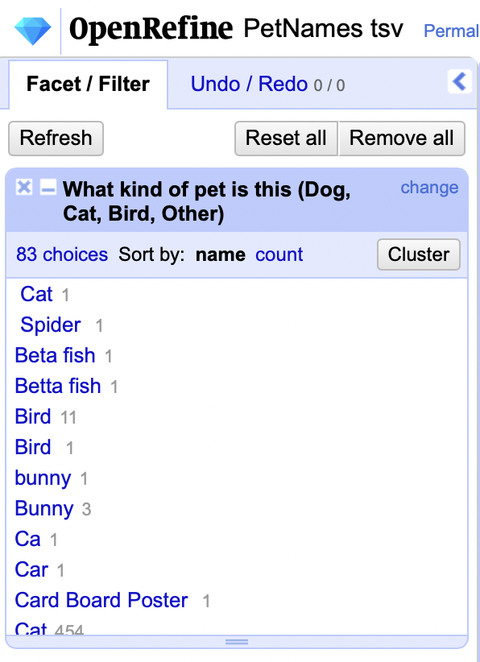

- I applied common transform by clicking on ‘Edit cells -\> Common
  transforms -\> Trim leading and trailing whitespace’ to remove white
  spaces in the data.

- I clicked on Edit cells-\>Cluster and edit. Then I could see the
  following.

- From the image, we can see that data contains variants of the names
  for many pets like(Dog, dog). To fix this, I merged these values by
  giving the New cell value as “Dog” and clicked on “merge selected &
  re-cluster”.

- By using the different string comparison algorithms (choose a
  different method and/or keying function), you can find issues with
  other kind of pets as well. Same process has been followed to fix this
  as well.

- After fixing the column “What kind of pet is this” by using different
  string comparision algorithms, there are 44 choices left in this
  column.

- I did a text facet on the column “What kind of pet is this (Dog, Cat,
  Bird, Other)”, then I found issues such as “Other: bees” where we can
  remove the word “Other”.

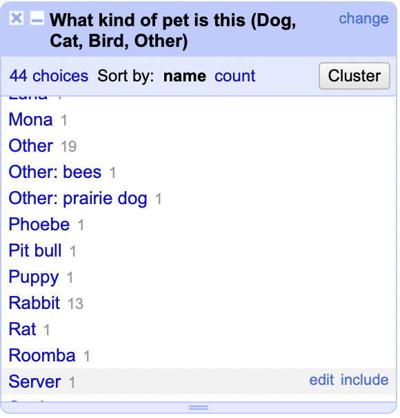

- Now, Click on the “What kind of pet is this (Dog, Cat, Bird, Other)”
  column again, and create a custom text facet to locate all the rows
  with the word “Other:” in them. Facet -\> Custom text facet

      value.contains("Other: ")

- Then click on Edit cells -\> Transform.

      value.replace("Other: ","")

- I did a text facet on the column “What kind of pet is this (Dog, Cat,
  Bird, Other)”, and clicked on “Sog” to find out what it is. Matching
  rows with “Sog” column name appeared.

- Based on the Pet’s breed column, I came to conclusion that the column
  (“What kind of pet is this”) with name “Sog” comes under Dog. So, I
  clicked on edit and named it as “Dog” and then clicked on “Apply to
  all identical cells”.

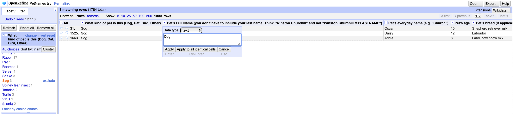

- After cleaning the column “What kind of pet is this” by using
  different string comparision algorithms, there are 34 choices left in
  this column.

## Step-2: Cleaning up “Pet’s age” column:

- My goal is to make whole column in terms of years. So, I would like to
  change months/weeks/days into years value. I would like to remove
  “years” text in the pet’s age column and replace with empty string
  using GREL expression. To do this, I clicked on Edit cells -\>
  Transform

      value.replace("years","")

- I did custom text facet on the pet’s age column by clicking on ‘Facet
  -\> custom text facet’ to locate all the rows with a word “months” in
  them.

      value.contains("months")

- I would like to choose “true” option to show custom “months” data.

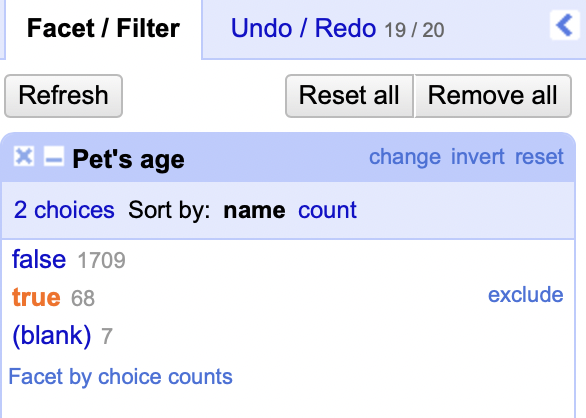

- Now, I clicked on ‘Edit cells -\> Transform’ to convert to numeric
  years by applying 1 month = 0.0833334 year

      toNumber(value.replace("months",""))*0.0833334

- 60 records of “Pet’s age” have been transformed after performing the
  above step.

- After transformation, there are some cells left with “about”, “old”
  and some random text data in the pet’s age column. I removed them with
  GREL expression below:

      value.replace("about","").replace("(puppy puppy!!!!)","").replace("old","").replace("a few","").replace("&","").replace("and a","").replace("half","1/2")

- Now, there are some cells left with “1/2 months” in the pet’s age
  column.

- I removed them with GREL expression below:

      toNumber(value.replace("months","").replace("1/2",""))*0.5*0.0833334

- I did custom text facet on the pet’s age column by clicking on ‘Facet
  -\> custom text facet’ to locate all the rows with a word “weeks” in
  them.

      value.contains("weeks")

- I would like to choose “true” option to show custom “months” data.

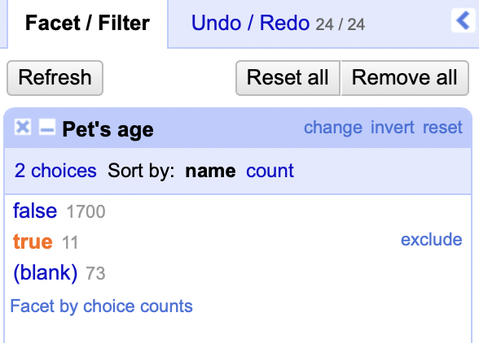

- Now, I clicked on ‘Edit cells -\> Transform’ to convert to numeric
  years by applying 1 week = 0.0191781 year

      toNumber(value.replace("weeks",""))*0.0191781

- 10 Cells have been affected or transformed by performing the above
  operation.

- Then, I applied the below expression to perform custom text transform
  on Pet’s age column which affected 54 cells.

      value.replace("?","").replace("~","").replace("ish","").replace("≈","").replace("YO","").replace("old","").replace("mo","months").replace("monthsnths","months").replace("monthsnth","").replace("human","").replace("() (rescue)","").replace("year","")

- I did transform pet’s column to numeric by clicking on ‘Edit cells -\>
  common transforms -\> To number’

- After cleaning the column “Pet’s age” by multiple replace
  transformations to numeric column.
  

## Step-3: Cleaning up “Pet’s Full Name” column:

- I did text facet to see the number of choices and to go through data.

- I applied common transform by clicking on ‘Edit cells -\> Common
  transforms -\> Trim leading and trailing whitespace’ to remove white
  spaces in the data.

- I clicked on ‘Edit cells -\> Cluster and edit’. Then I could see the
  following.

- From the image, we can see that data contains variants of the names
  (Brownie, brownie). To fix this, I merged these values by giving the
  New cell value as “Brownie” and clicked on “merge selected &
  re-cluster”.

- By using the different string comparison algorithms (choose a
  different method and/or keying function), I identified the similar and
  misspelled values in the cluster and merged them accordingly.

- After cleaning “Pet’s Full Name” column, 1446 choices left in this
  column.

## Step-4: Cleaning up “Pet’s everyday name” column:

- I did text facet on the “Pet’s everyday name” column to see the number
  of choices and to go through data.

- I applied common transform by clicking on ‘Edit cells -\> Common
  transforms -\> Trim leading and trailing whitespace’ to remove white
  spaces in the data. 178 cells in this column have been affected.

- I clicked on ‘Edit cells -\> Cluster and edit’. Then I could see

- From the image, we can see that data contains variants of the names
  (Moose, moose). To fix this, I merged these values by giving the New
  cell value as “Moose” and clicked on “merge selected & re-cluster”.

- By using the different string comparison algorithms (choose a
  different method and/or keying function), I identified the similar and
  misspelled values in the cluster and merged them accordingly.

- After cleaning “Pet’s everyday name” column, 1298 choices left in this
  column.

## Step-5: Cleaning up “Pet’s breed” column:

- I did text facet on the “Pet’s breed” column to see the number of
  choices and to go through data.

- I applied common transform by clicking on ‘Edit cells -\> Common
  transforms -\> Trim leading and trailing whitespace’ to remove white
  spaces in the data. 376 cells in this column have been affected.

- I clicked on ‘Edit cells -\> Cluster and edit’. Then I could see the
  following.

- From the image, we can see that data contains variants of the names
  (for example- Golden Retriever, golden retriever). To fix this, I
  merged these values by giving the New cell value as “Golden Retriever”
  and clicked on “merge selected & re-cluster”.

- By using the different string comparison algorithms (choose a
  different method and/or keying function), I identified the similar and
  misspelled values in the cluster and merged them accordingly.

- I googled some of the pet’s breed and merged them accordingly.

- After cleaning “Pet’s breed” column, 481 choices left in this column.

# Part2. Analyze Cleaned Data

**1. How many types (kinds) of pets are there?**

- On “What kind of pet is this?” column, I clicked on Facet -\> Text
  facet. The result is as shown in below image.

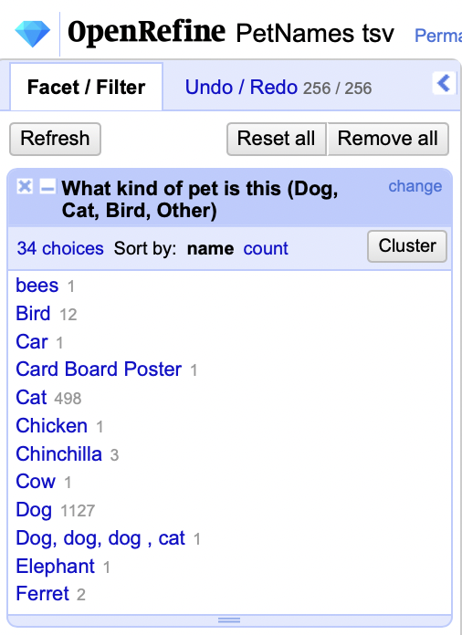

- Therefore, there are 34 kinds of pet’s.

**2. How many dogs?**

- On “What kind of pet is this?” column, I clicked on Facet -\> Text
  facet. Then we can see the choices for this column.

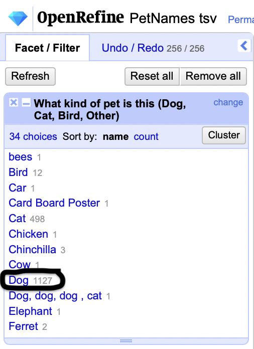

- There are 1127 choices for the dog in the “What kind of pet is this”.

**3. How many breeds of dogs?**

- On “What kind of pet is this?” column, I clicked on Facet -\> Text
  facet. Then we can see the choices for this column.

- Then I clicked on Dog, then it shows Dog matching records.

- Then, On the “Pet’s breed” column, I clicked on Facet -\> Text facet
  which shows the Dogs breed choices.

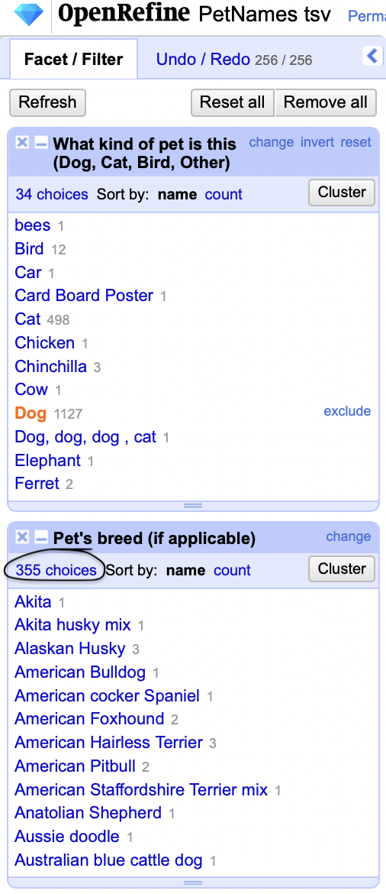

- Number of breeds of Dog = 355

**4. What’s the most popular dog breed?**

- On “What kind of pet is this?” column, I clicked on Facet -\> Text
  facet. Then we can see the choices for this column.

- Then I clicked on Dog, then it shows Dog matching records.

- Then, On the “Pet’s breed” column, I clicked on Facet -\> Text facet
  which shows the Dogs breed choices.

- Then, Sort by count to see the most popular dog breed.

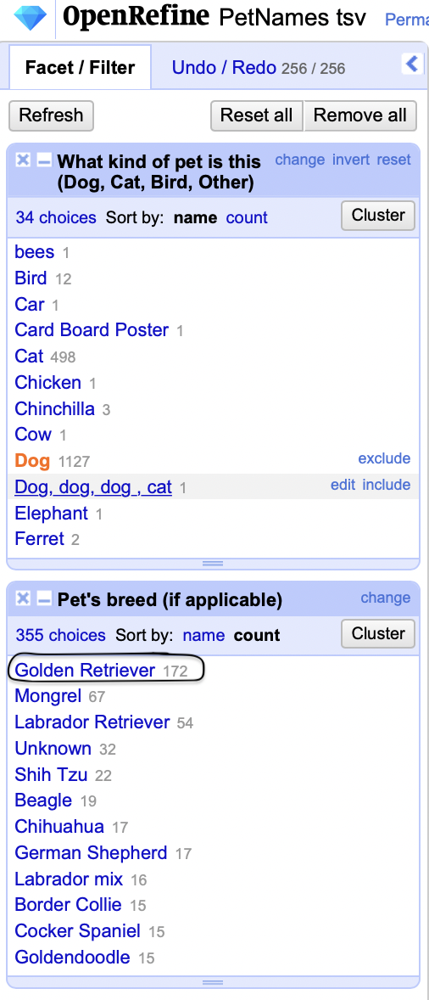

- Therefore, most popular dog breed is “Golden Retriever (172)”.

**5. What’s the age range of the dogs?**

- On “What kind of pet is this?” column, I clicked on Facet -\> Text
  facet. Then we can see the choices for this column.

- Then I clicked on Dog, then it shows Dog matching records.

- Then, On the “Pet’s age” column, I clicked on Facet -\> Numeric facet
  which shows the range of the dog’s age.

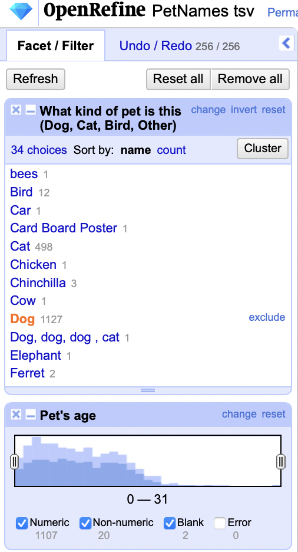

- Age range of the dogs is 0-30 years.

**6. What’s the age range of the guinea pigs?**

- On “What kind of pet is this?” column, I clicked on Facet -\> Text
  facet. Then we can see the choices for this column.

- Then I clicked on Guinea pig, then it shows Guinea pig matching
  records.

- There are only 10 matching records for guinea pig.

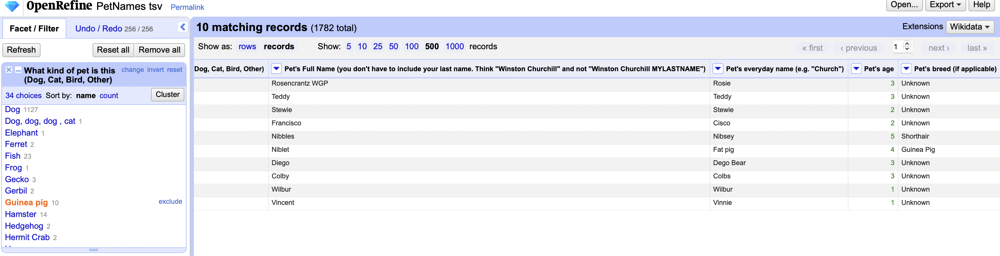

- From the above image, we can say that age range of the guinea pig is
  1-5 years.

**7. What is the oldest pet?**

- On “What kind of pet is this?” column, I clicked on Facet -\> Text
  facet. Then we can see the choices for this column.

- On “Pet’s age” column, I clicked on sort -\> numbers -\> largest
  first.

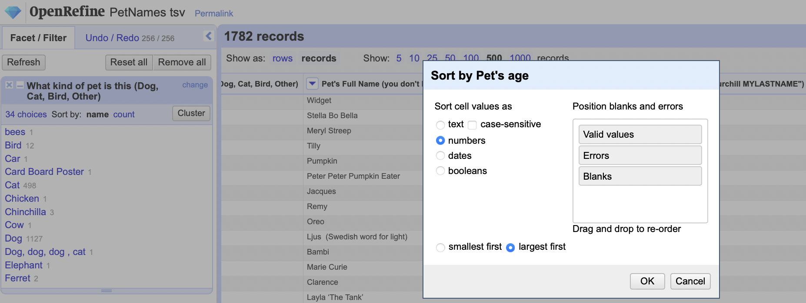

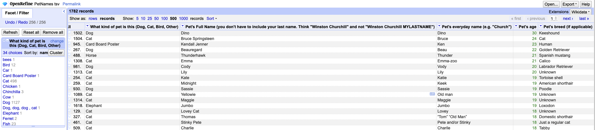

- Dog (breed-Keeshound) with the name Dino is the oldest pet whose age
  is 30 years.

**8. Which are more popular, Betta fish or goldfish? How many of each?**

- On “What kind of pet is this?” column, I clicked on Facet -\> Text
  facet. Then we can see the choices for this column.

- Then I clicked on Fish, then it shows fish matching records.

- On “Pet’s breed” column, I clicked on Facet -\> Text facet. Then we
  can see the choices for fish breed.

- Then, Sort by count to see the most popular fish breed.

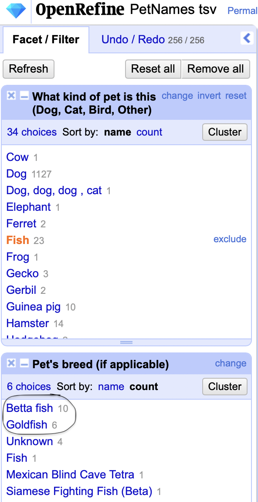

- Therefore, Betta fish (10) are popular. There are 10 Betta fish and 6
  Goldfish.

**9. What’s the most popular everyday name for a cat?**

- On “What kind of pet is this?” column, I clicked on Facet -\> Text
  facet. Then we can see the choices for this column.

- Then I clicked on Cat, then it shows Cat matching records.

- Then, On the “Pet’s everyday name” column, I clicked on Facet -\> Text
  facet which shows the “Pet’s everyday name” choices.

- Then, Sort by count to see the most popular everyday name for a cat.

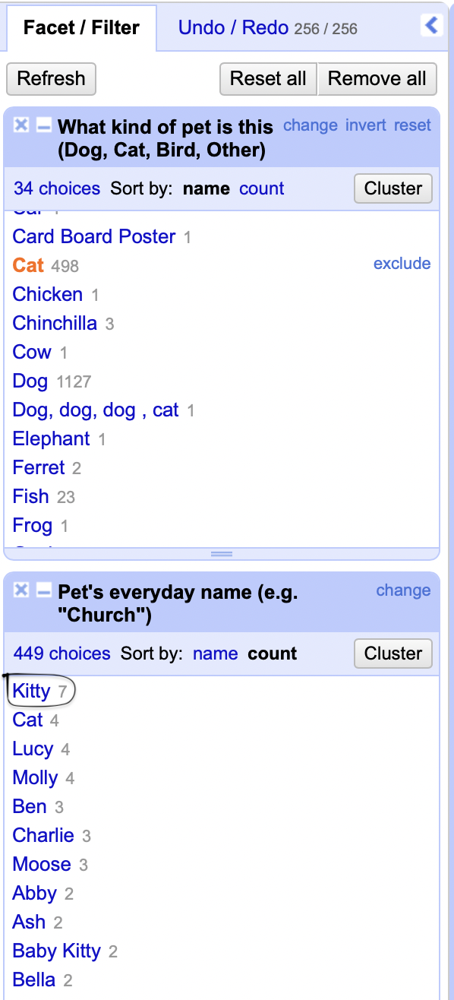

- Therefore, most popular everyday name for a cat is “Kitty (7)”.

**10. What’s the most popular full name for a dog?**

- On “What kind of pet is this?” column, I clicked on Facet -\> Text
  facet. Then we can see the choices for this column.

- Then I clicked on Dog, then it shows Dog matching records.

- Then, On the “Pet’s Full Name” column, I clicked on Facet -\> Text
  facet which shows the “Pet’s Full Name” choices.

- Then, Sort by count to see the most popular fullname for a dog.

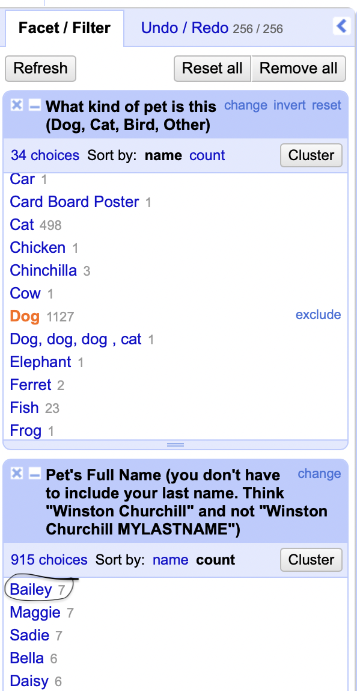

- Therefore, most popular full name for a dog is “Bailey (7)”.

# References

- Reference 1,
  <https://github.com/odu-cs625-datavis/github-classroom-for-students/blob/master/README.md>

- Reference 2, <https://www.markdownguide.org/basic-syntax>

- Reference 3,
  <http://web.archive.org/web/20190105063215/enipedia.tudelft.nl/wiki/OpenRefine_Tutorial>

- Reference 4,
  <https://openrefine.org/docs/manual/expressions#grel-general-refine-expression-language>

- Reference 5,
  <https://www.propublica.org/nerds/using-google-refine-for-data-cleaning>
