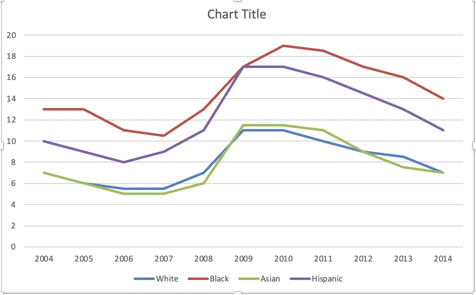
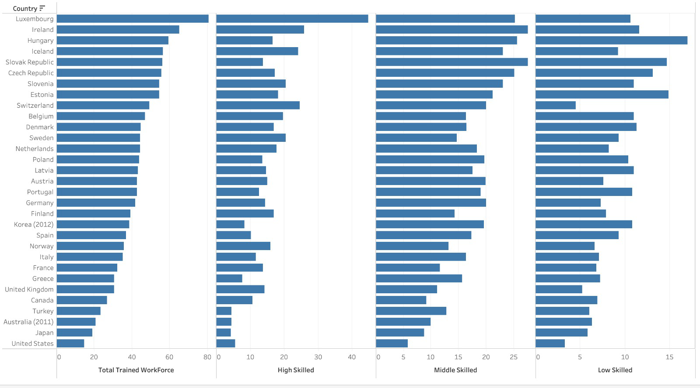

CS625-HW3
================
Syamala Akhila Devi Bolla
2023-02-16

## Part 1 - Choose one chart, can use Excel, Tableau, R, or Vega-Lite

#### *1. Image and link to the original chart*

##### Given Line chart \#1

|  | article: [Remake: Paired Column Chart from WSJ](https://policyviz.com/2018/03/01/remake-paired-column-chart-from-wsj/) Excel data file: [PolicyViz_WSJ_Remake.xlsx](http://policyviz.com/wp-content/uploads/2018/02/PolicyViz_WSJ_Remake.xlsx) |
|-----------------------------------------------------------------------------------------------------------------------|----------------------------------------------------------------------------------------------------------------------------------------------------------------------------------------------------------------------------------------------------|

#### *2. Image of the re-created chart*

- Please find the image that I re-created using excel below.

- Idioms - Line Chart

- Marks used - Dots (to encode attributes)

- Channels used - X-axis, Y-axis and color (To encode attributes)

- Data Attributes, their attribute types, and the channels used to
  encode those attributes

1.  Year - Ordinal (ordered) - Horizontal position (X-axis)
2.  Percentage - Quantitative - Vertical position (Y-axis)
3.  Ethnicity - Categorical/Nominal - Color

#### *3. Description of how I created the chart in the tool of my choice*

- I created the above line chart using excel.
- I downloaded the given excel data file:
  [PolicyViz_WSJ_Remake.xlsx](http://policyviz.com/wp-content/uploads/2018/02/PolicyViz_WSJ_Remake.xlsx)
- I selected all the entire columns (Year, White, Black, Asian,
  Hispanic) in the excel and clicked on Insert -\> Recommended Charts
  -\> Line. Then I got a line graph like below.

- To recreate it like the given line chart \#1, I changed the Hispanic
  line color to orange by double clicking on the line.
- By clicking on the single data point on the each line, I added data
  labels (Black, Hispanic, White, Asian) by selecting “Add Data Label”.
- I gave the colors to the data labels that is matching with their line
  color.
- I deleted the legend that is present at the bottom of the chart.
- By following the above steps, I re-created the line chart using excel
  according to the given original chart.

- I gave chart title as “Out of Work” with the font size-“16”,
  font-“Calibri(Body)” and made it bold.
- I also inserted a text box below with the text “Families with at least
  one member unemployed” and gave the font size-“14” &
  font-“Calibri(Body)”.

#### *4. Assessment of how close I was able to re-create the chart (what things were I not able to re-create?)*

- I was able to re-create chart exactly according to the given line
  chart \#1 using excel.

#### *5. Assessment of the tool I used and how flexible it was in terms of being able to re-create the chart*

- I used Excel to re-create the Line chart \#1. Its so flexible to use.
  In the charts group, we can select the desired chart category (for
  example: column, bar, line, pie) and we can also chart type (for
  example: clustered column). We are able to add, rename and are also
  able to change color of the chart labels. These features made the
  excel flexible to use for re-creating the desired chart.

#### *6. Explain how the idiom choice is appropriate for the data and the task*

- In this instance, the unemployment rates among and between four
  distinct racial/ethnic groupings between 2004 and 2014 are being
  compared. Both of these jobs are challenging due to the overwhelming
  number of columns. The simplest recreation would be to simply make it
  a line chart.

## Part 2 - Choose one chart, can use Tableau, R, or Vega-Lite (no Excel)

#### *1. Image and link to the original chart*

##### Given Small Multiples Bar chart

|  | article: [Remaking an OECD Stacked Bar Chart](https://policyviz.com/2017/11/30/remaking-oecd-stacked-bar-chart-general-comments/) Excel data file: [PolicyViz_OECD_Skills_Data.xlsx](http://policyviz.com/wp-content/uploads/2017/11/PolicyViz_OECD_Skills_Data.xlsx) |
|----------------------------------------------------------------------------------------------------------------------|---------------------------------------------------------------------------------------------------------------------------------------------------------------------------------------------------------------------------------------------------------------------------|

#### *2. Image of the re-created chart*

- Please find the image that I re-created using tableau below.

- Idioms - Bar Chart

- Marks used - Line (to encode attributes)

- Channels used - X-axis, Y-axis and color (to encode attributes)

- Data Attributes, their attribute types, and the channels used to
  encode those attributes

1.  Skill Levels (Individual and total) - Categorical - Horizontal
    position (X-axis)
2.  Country - Categorical - Vertical position (Y-axis)
3.  Percentage - Quantitative - Color

#### *3. Description of how I created the chart in the tool of my choice*

- I re-created the Small Multiples Bar Chart using Tableau.
- I downloaded the given excel data file:
  [PolicyViz_OECD_Skills_Data.xlsx](http://policyviz.com/wp-content/uploads/2017/11/PolicyViz_OECD_Skills_Data.xlsx)
- I loaded the downloaded file into the tableau desktop as data source.
  Tableau processed the data and showed us the available columns in the
  sheet.
- I renamed the columns into the desired format. Renamed the “Total”
  column as “Total Trained Workforce”, “Medium skilled” column as
  “Middle skilled” and “F1” to “Country”.
- I dragged the Low Skilled, Middle Skilled, High Skilled, Total Trained
  Workforce to “Columns” and dragged the country to “Rows”.
- We will get a chart like below. 
- To move the axis labels from the bottom to top, I dragged the Low
  Skilled, Middle Skilled, High Skilled, Total Trained Workforce to
  “Columns” again.
- Right clicked on newly dragged columns and checked “Dual Axis”. Now I
  got the titles on the top and bottom of the chart.
- Now, I clicked on the bottom titles and selected edit axis. On a “Tick
  Marks” tab, put ticks to none. Also cleared the title on the “General”
  tab.
- I repeated the same process for every measure.
- Now, I right clicked on column names- Low Skilled, Middle Skilled,
  High Skilled, Total Trained Workforce and changed the font size and
  color of the column names according to the original chart.
- Select the column names in the “More Fields” dropdown and change the
  colour of the bars according the original chart.
- I made one axis opacity to zero to avoid any confusion and used
  uniformed axis of all the columns.
- By following the above steps, I re-created the small multiples bar
  chart using tableau according to the given original chart.

#### *4. Assessment of how close I was able to re-create each chart (what things were I not able to re-create?)*

- I was able to re-create the chart exactly according to the given small
  multiples bar chart using tableau.
- I added tableau worksheet- “HW3_Part2_Recreation_Tableau” in the
  files.

#### *5. Assessment of the tool I used and how flexible it was in terms of being able to re-create the chart*

- I used Tableau to re-create the “Small Multiples Bar Chart”. Its so
  flexible to use. We can change the mark types (for example: bar,
  square, circle) and we can also add axis range.
- There are many options for exploring change over time, including line
  charts, slope charts, and highlight tables.
- We are able to add, rename and are also able to change color of the
  chart labels and mark types. These features made the tableau flexible
  to use for re-creating the desired chart.

#### *6. Explain how the idiom choice is appropriate for the data and the task*

- With the stacked charts, the primary problem is that it’s difficult to
  compare categories that do not share the same vertical baseline; in
  this case, the medium and low skilled groups. You can easily see the
  total. It is also helpful that they sorted it in that way but you have
  a hard time comparing the individual categories other than the High
  skilled group.

- For the simplest recreation, I divided the chart into four separate
  charts. In order to keep the possibility to compare the totals, I
  added a fourth series that displays the total after placing each
  individual skills series on its own vertical axis. In addition, I
  reversed the order of the series, moving from Low Skilled to High
  Skilled.

# References

- <https://community.tableau.com/s/question/0D54T00000C5zRrSAJ/how-to-change-a-vertical-bar-chart-horizontal>
- <https://policyviz.com/2017/11/30/remaking-oecd-stacked-bar-chart-general-comments/>
- <https://policyviz.com/2018/03/01/remake-paired-column-chart-from-wsj/>
- <https://help.tableau.com/current/pro/desktop/en-us/gettingstarted_overview.htm>
- <https://tech.olx.com/tableau-how-to-moving-axis-label-from-bottom-to-top-65ba627cfa53>
- <https://excelquick.com/excel-charts/add-a-data-label-to-one-chart-line-point/>
