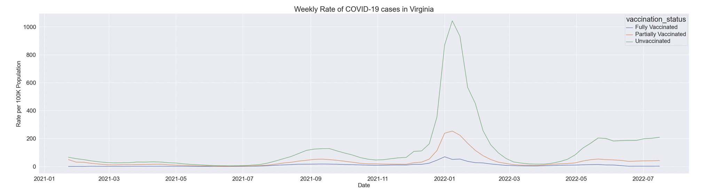

```{r setup, include=FALSE}
knitr::opts_chunk$set(echo = TRUE)
```

## Part 1: "How has the weekly rate of COVID-19 cases in Virginia changed over time based on vaccination status?"

* This (dataset1) dataset includes the number of COVID-19 infections, hospitalizations, and deaths for each health region in Virginia by the week of onset/specimen collection and by vaccination status.

* This dataset has 29340 rows and 8 columns. Each row represents the weekly count of covid-19 infections, hospitalizations, deaths and population for each health planning region in virginia by vaccination status (fully vaccinated, partially vaccinated, unvaccinated) based on event date.

* **The attributes and their data types of data used:** 
Attribute | Attribute Type
---- | ---- 
Report Date | Ordinal 
Week Ending Date | Ordinal
Health Region   |   Categorical/Nominal
Vaccination Status |   Categorical/Nominal
Infections   |   Quantitative
Hospitalizations  |   Quantitative
Deaths   |   Quantitative
Population Denominator  |  Quantitative

* **Data Manipulation Calculating the Weekly rate** 
* As there are varying populations in each vaccination state over time, we want to standardize the values rather than just display the raw data. 

* The population denominator attribute gives an estimate of the number of people in the state who have the particular vaccination status for that week. 

* Idioms - Line Chart

* Marks used - Dots (to encode attributes)

* Channels used - X-axis, Y-axis and color (To encode attributes)

* Data Attributes, their attribute types, and the channels used to encode those attributes
1. Date - Ordinal (ordered) - Horizontal position (X-axis)
2. Rate_per_100k - Quantitative - Vertical position (Y-axis)
3. Vaccination Status - Categorical - Color

* I used color channel for the vaccination status because we can differentiate three lines with colors easily and that would be appropriate to use.

* From the above attributes and its types, the choice of idiom is "Line Chart".

* **Why Line Chart?**

* A line graph, which consists of a series of data points connected by straight line segments on two axes, is frequently used to display change over time. Because one group of numbers is constantly dependent on the other, the line graph helps in determining the relationship between two sets of values. 

* The Week Ending Date variable represents continuous values with a regular interval of measurement on the horizontal axis. 

* This variable generates an observation once a week and is temporal. 

* For points that fall inside each of the intervals defined by the horizontal axis variable, rate per 100k is a numerical variable on the vertical axis. 

* There will be a statistical summary of events within each bin as a total or average value. 

* To examine the trend between vaccination statuses, multiple lines are plotted on a single line chart. This is frequently used to track how the data is distributed among different subgroups.

* **Design decisions that I made in creating the chart**

* To design the chart, I used python and python notebook (part-1.ipynb) included in the files.

* I used pandas, matplotlib and seaborn libraries for this. I imported the dataset into a dataframe and verified that each datatype was accurate. I changed the report date ,week ending date to date time attribute and vaccination status, health region to categorical attribute.

* Then applied the rate per 100k formula to whole dataframe to create new column of rate_per_100k.

df['rate_per_100k'] = (df['infections'] / df['population_denominator']) *100000

* Then using seaborn and matplotlib libraries, I plotted the graph. I added legend which is color channel that helps to know about the vaccination status. I added header label as “Weekly Rate of COVID-19 cases in Virginia” and added x-axis (Date) and y-axis (Rate per 100K population) labels.

* **Answer to the question**



* The Graph shows the COVID 19 infections trend of three groups (Fully vaccinated, Unvaccinated, Partially Vaccinated) over the time.

* From the graph we can answer the question that, the people who are unvaccinated showed high infection rate followed by partially vaccinated and fully vaccinated.

## Part 2: "For each health district in Virginia, what proportion of all 1st doses were of the Pfizer vaccine?"

* This dataset includes the number of COVID-19 vaccine doses administered for each locality in Virginia by administration date and by facility type. The data set increases in size daily and as a result, the dataset may take longer to update. However, it is expected to be available by 12:00 noon daily.

* This dataset has 1203735 rows and 8 columns. The columns in the dataset are Administration Date - Date when the vaccine dose is administered to a person, FIPS - 5-digit code (51XXX) for the locality, Locality - Independent city or county in Virginia where the person lives who was administered the vaccine, Health District - Health district name assigned by the Virginia Department of Health (There are 35 health districts in Virginia), Facility Type - Facility type of the provider that performed the vaccine administration, Vaccine Manufacturer - Name of the manufacturing company that produced the vaccine, Dose Number - Dose number for the person who is administered the vaccine, Vaccine Doses Administered Count - Total number of vaccine doses administered.

* **The attributes and their data types of data used:** 
Attribute | Attribute Type
---- | ---- 
Administered Date | Ordinal 
FIPS | Categorical
Locality | Categorical
Health District | Categorical
Facility Type  |  Categorical
Vaccine Manufacturer | Categorical
Dose Number | Quantitative
Vaccine Doses Administered Count | Quantitative

* **Data Manipulation**

* The provided data includes every aspect of the dose numbers. Using filtering techniques, we separate the data into only first doses i.e, which dose number is equals to 1. 

* By using the above filtration, we are able to obtain information on every first dose. From this, we must determine what percentage of all first doses were of the Pfizer vaccine?

* Idioms - Bar Chart

* Marks used - Lines (Dots) (to encode attributes)

* Channels used - X-axis, Y-axis and color (To encode attributes)

* Data Attributes, their attribute types, and the channels used to encode those attributes
1. Health District - Categorical - Horizontal position (X-axis)
2. Vaccination Count for 1st Dose - Quantitative - Vertical position (Y-axis)
3. Vaccination Manufacturer - Categorical - Color

* I used color channel for the vaccination manufacturer as we can differentiate the categories easily.

* From the above attributes and its types, the choice of idiom is "Stacked Bar Chart".

* **Why Stacked Bar Chart?**

* The first thing that comes to mind when we see categorical data on the X-axis is a bar chart, but because there are so many categories, there are too many bars representing the vaccine manufacturer for each health district. Thus, a stacked bar chart is a good substitute. 

* We can use Moderna as the blue channel, Pfizer 5-11 as orange, Pfizer 12+ as green, Pfizer as red, and J&J as violet with the color channels being the X-axis for the health district, the Y-axis for vaccination count, and the inside bars for the vaccination manufacturer. 

* We can distinguish the percentage of each vaccine administered by looking at the bar at each health district with the color channel on the side of the bar after the graph has been plotted.

* **Design Decisions**

* To Plot the stacked bar chart, i used python and its libraries which part-2.ipynb notebook is included in the files.

* Loaded the data into pandas dataframe using the link given in the dataset 2.

* Then Filtered the dataframe to get only first dose data of all health districts.

* Then Created Stacked bar chart using seaborn, added title as “Proportion of all 1st doses in each health district”, added Y-axis label as “Vaccination Count for 1st Dose”, added X-axis label as Health District.

* Added color channel as vaccination Manufacturer, rotated the x tick labels to 90 degrees to avoid overlap in x-tick labels.


* **Answer to the Question**

* From the above graph we can see the distribution of vaccine in each health district and color channel for vaccination manufacturer.

* The question is to find the proportion of Pfizer vaccination in each health district, so if we take any health district bin/bar if the color is red then that is Pfizer vaccination proportion is given in health district.

* For Example, If we consider Richmond health district bar which we can see that red and green color in equal proportion, red is Pfizer and Green is Pfizer 12+.

## Part 3: Propose two questions that require data from dataset 1 and dataset 2 to be combined to answer.

**Question 1-Infection Rate based on Vaccination Facilities?**

Data Manipulation

* To answer the question first we need to create a column for new column in dataset 2 of health region, identify each health district with central, southern/northern region. Then Combine the two datasets with health regions to get number of infections based on regions which includes vaccination facilities.

* Now we can proceed to draw the graph infection rate over the time in various facilities. The choice of idiom is line chart.

* Horizontal axis channel with date, Vertical axis channel with Rate of infection per 100k and color channel with facility center.

**Sketch Chart**


**Question 2-Rate of death based on vaccination dose**

Data Manipulation

* To answer this question, we need to create a column for new column in dataset-2 of health region, identify each health district with central.southern/northern region. Then Combine the two datasets based on health regions .

* Now we can proceed to draw the graph with death rate over the time with vaccination dose number as color channel .The choice of idiom is line chart .

* Horizontal axis channel with date ,Vertical axis channel with Death Rate and color channel with vaccination doses .

**Sketch Chart**


## References

* Reference 1 - https://data.virginia.gov/dataset/VDH-COVID-19-PublicUseDataset-Cases-by-Vaccination/vsrk-d6hx

* Reference 2 - https://data.virginia.gov/dataset/VDH-COVID-19-PublicUseDataset-Vaccines-DosesAdmini/28k2-x2rj

* Reference 3 - https://pythonguides.com/stacked-bar-chart-matplotlib/

* Reference 4 - https://docs.github.com/en/get-started/writing-on-github/getting-started-with-writing-and-formatting-on-github/basic-writing-and-formatting-syntax

* Reference 5 - https://seaborn.pydata.org/generated/seaborn.lineplot.html
