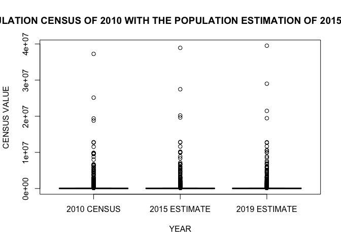
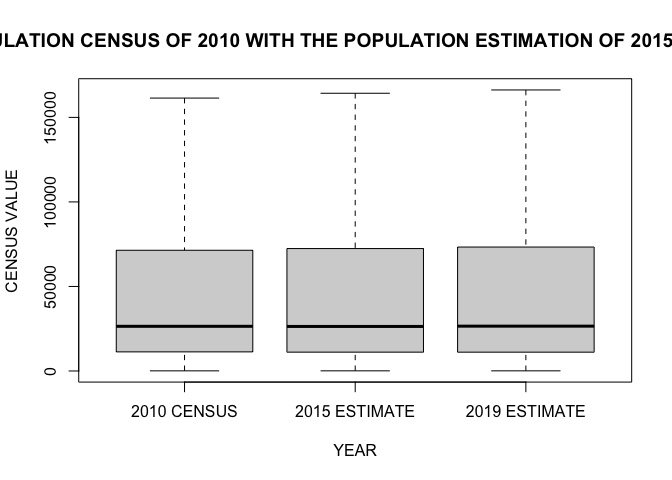
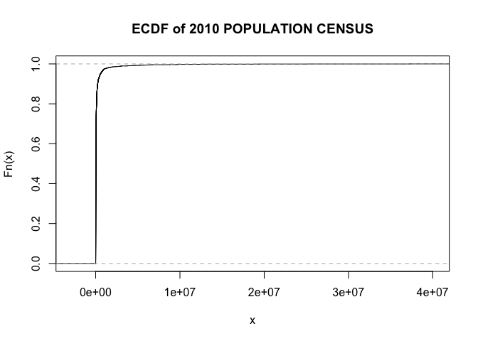
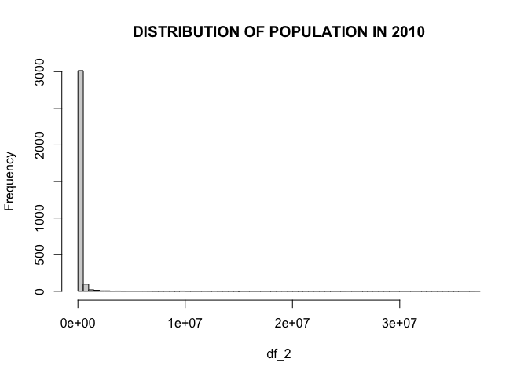
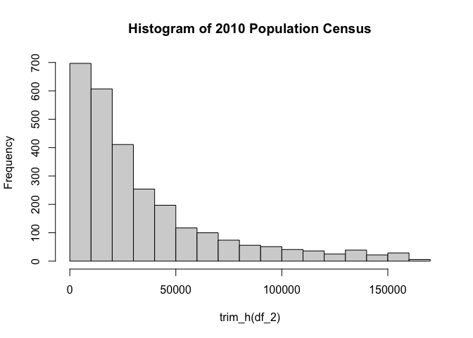

CS625-HW5
================
Syamala Akhila Devi Bolla
2023-03-22

## Part 1: Create Distribution Charts

- I choosed the first dataset - [US Census Bureau County Population
  dataset](https://www.census.gov/data/datasets/time-series/demo/popest/2010s-counties-total.html#par_textimage_70769902)
  (CO-EST2019-alldata) which has 3194 rows and 164 columns.

#### Question1: For the boxplot, show the distribution of the population of all counties in the US as of the 2010 Census (`CENSUS2010POP`), the 2015 estimate (`POPESTIMATE2015`), and the 2019 estimate (`POPESTIMATE2019`) (should result in 3 separate boxplot glyphs in a single chart)

### Boxplots (box-and-whisker diagrams):

- Boxplots are useful and convenient for summarizing and visualizing the
  distribution of a dataset, and can help to identify patterns, trends,
  and outliers that may not be immediately apparent from the raw data.
  Box Plots can be drawn either vertically or horizontally.

### Importing the Data

``` r
data <- read.csv(file="./co-est2019-alldata.csv")
df <- subset(data)
```

- The data is imported into data variable that displays data in
  different format. So, format the data using subset. Then, we will get
  data in proper rows and columns.

- Converted the data and stored in df and the data is displayed which
  has 164 columns.

- To Perform the given task we need to filter out only 2010 Census
  (CENSUS2010POP), 2015 estimate (POPESTIMATE2015), 2019 estimate
  (POPESTIMATE2019) columns.

``` r
df_1 <- df[, c("CENSUS2010POP", "POPESTIMATE2015", "POPESTIMATE2019")];
head(df_1)
```

    ##   CENSUS2010POP POPESTIMATE2015 POPESTIMATE2019
    ## 1       4779736         4852347         4903185
    ## 2         54571           54864           55869
    ## 3        182265          202939          223234
    ## 4         27457           26283           24686
    ## 5         22915           22566           22394
    ## 6         57322           57526           57826

- The data is filtered and displayed the contents of data.

- Using R functions plot the box plot for the data, added title as
  “POPULATION CENSUS OF 2010 WITH THE POPULATION ESTIMATION OF 2015 and
  2019” and the x axis element labels as “2010 CENSUS”, “2015 ESTIMATE”,
  “2019 ESTIMATE” which comes under “YEAR” and y axis labels as “CENSUS
  VALUE”.

- The plot is shown below:

``` r
label = c("2010 CENSUS", "2015 ESTIMATE", "2019 ESTIMATE");
boxplot(df_1, main="POPULATION CENSUS OF 2010 WITH THE POPULATION ESTIMATION OF 2015 and 2019", ylab="CENSUS VALUE", xlab="YEAR",names=label)
```

<!-- --> \###
Observation:

- The output is not as expected, the three glyph’s in the box plot are
  not clear enought too see five points.

- There are significant outliers on the upper side of the glyph.

- According to the graph, all the five points (min, 25%, median, 75%,
  and max) are marked on one single line.

- We have a option to plot the data without the outliers which helps us
  to look at the data and get the five point values.

### Advantages:

- No Advantages since the Visualization of the glyph is poor.

### Disadvantages:

- I could not identify all the statistical values using the boxplot.

- The plot need a manipulation for better visualization.

- The range and IQR could not be distinguished.

``` r
label = c("2010 CENSUS", "2015 ESTIMATE", "2019 ESTIMATE")
boxplot(df_1,outline=FALSE, main="POPULATION CENSUS OF 2010 WITH THE POPULATION ESTIMATION OF 2015 and 2019", ylab="CENSUS VALUE", xlab="YEAR", names=label)
```

<!-- -->

### Observations:

- From the above boxplot, we could see that the outliers have been
  removed and all the five points(min, 25%, median, 75%, and max) can
  differentiated.

- The population count is very clear, and I could tell the approximate
  value at each of the five required points.

### Advantages:

- By eliminating the outliers, five statistical points have been
  identified.

- The Inter Quartile Range (IQR) is clearly identified.

- The values can be easily compared between three glyphs.

- Median values can also be identified.

### Disadvantages:

- We don’t know how accurate is the output because the outliers had huge
  impact on previous graph.

#### Question2: For the eCDF and histogram, show the distribution of the population of all counties in the US as of the 2010 Census (`CENSUS2010POP` column)

### eCDF (Empirical Cumulative Distribution Function):

- An empirical cumulative distribution function (eCDF) is a
  non-parametric estimator of the cumulative distribution function (CDF)
  of a random variable. It is a step function that gives the proportion
  or fraction of data points that are less than or equal to a certain
  value. To construct an eCDF, the data points are first sorted in
  ascending order.

- Only the 2010 Census population (CENSUS2010POP) is assigned to df_2
  variable.

``` r
 df_2 <- df[ , c("CENSUS2010POP")]
```

- Imported the reshape library for using melt() function.

``` r
library(reshape2)
```

- The melt() function in R is part of the reshape2 package and it allows
  you to reshape a wide-format data frame into a long-format data frame.
  The melt() function takes a wide-format data frame and reorganizes it
  into a long-format data frame.

``` r
data_long <- melt(df_2)               #Reshaping data frame
head(data_long)                       #Print head of long data
```

    ##     value
    ## 1 4779736
    ## 2   54571
    ## 3  182265
    ## 4   27457
    ## 5   22915
    ## 6   57322

``` r
ecdf(df_2)
```

    ## Empirical CDF 
    ## Call: ecdf(df_2)
    ##  x[1:3140] =     82,     90,    286,  ..., 2.5146e+07, 3.7254e+07

``` r
plot(ecdf(df_2),main="ECDF of 2010 POPULATION CENSUS")
```

<!-- -->

### Observation:

- X-axis and Y axis are quantitative values with CENSUS2010POP and
  Percentage.

- I could see a continuous step graph for the values across the x-axis
  and percentages across the y-axis.

- Most of the data points are concentrated within a small range and the
  data is scattered from two-digit number to millions, it appears to
  have less steps.

### Histogram:

- The number of bins in a histogram can be chosen independently of the
  number of items in the dataset. The purpose of a histogram is to
  display the distribution of a continuous variable, so the data is
  divided into a specified number of equally spaced bins along the
  x-axis, and the height of each bar represents the number of
  observations that fall within each bin. Choosing the appropriate
  number of bins for a histogram is important because it can affect how
  the data is perceived.

``` r
hist(df_2,main="DISTRIBUTION OF POPULATION IN 2010",breaks=10)
```

<!-- -->

### Observations:

- The view of bins, x-axis, and y-axis are not as expected.

- The title of graph has been set to “DISTRIBUTION OF POPULATION IN
  2010”.

- The bins breaks are 10 as given in the condition.

- The above histogram looks right skewed and most of the values seem
  concentrated in only one bin.

- Rest of the data points could not be clearly identified on the
  histogram.

- I could tell the approximate number by looking at the first bin and
  the y-axis, but I could not tell for the rest of the bins.

- The x-axis is scaled 0-millions.

- The y-axis has a number count from 0-2500.

- We knew there are 3193 counties with different population size.
  However, in this graph, the output is not clear because of the
  outliers.

``` r
hist(df_2,main="DISTRIBUTION OF POPULATION IN 2010",breaks=100)
```

<!-- -->

### Observation:

- The histogram is still right skewed and most of the values seems to be
  in only one bin.

- Rest of the data points could not be clearly identified on the
  histogram.

- The x-axis is scaled 0-millions.

- The y-axis has a number count from 0-3000.

- Maximum counties are still concentrated in one bin.

## Part 2: Further Analysis

### Histogram

- The above histogram with different bin sizes is not clearly showing
  the data distribution. Let’s try removing the outliers which may give
  us the clear picture of data.
- Let’s write a trimming function that removes outliers.

``` r
trim_h <- function(x){x[(x>quantile(x, 0.25) - 1.5 * IQR(x)) & (x<quantile(x, 0.75) + 1.5 * IQR(x))]}

hist(trim_h(df_2), main="Histogram of 2010 Population Census")
```

<!-- -->

### Observations:

- After removing the outliers, we can easily see the distribution of
  population over several counties.
- The bins, x-axis, and y-axis are displayed as expected.

### Advantages:

- Now, Able to compare data easily.
- Able to differentiate range of data in each bin.
- Able to easily find the approximate number of people with
  corresponding values.
- Able to easily identify the highest and lowest values.

### Disadvantages:

- It’s difficult to tell the exact value corresponding to each bin.

### More Examples

- The histogram with smaller bin size gives clear visualization of the
  data distribution.

``` r
hist(trim_h(df_2),main="Histogram of 2010 Population Census",breaks=50)
```

<!-- -->

#### ECDF

- Used the same trimming function to see whether any difference in ECDF.

``` r
plot(ecdf(trim_h(df_2)))                                  #Create ecdf plot in R
```

<!-- -->

### Observations:

- Able to fit the whole data in the definite axis.

- By modifying the data size and by eliminating the outliers, the data
  distribution is better.

- Corresponding value of each distribution could not be identified.

- The continuity between the range of each interval could not be
  identified.

### Conclusion

- The data which I worked on had a lot of outliers that made the
  evaluation of data distribution hard.

- After removing outliers, among the three different idioms (Boxplots,
  ECDF, Histogram), the histogram with a smaller number of bins gave a
  clear visualization of the data distribution.

## References

- Reference 1: <https://datavizcatalogue.com/methods/histogram.html>

- Reference 2:
  <https://statisticsglobe.com/draw-multiple-boxplots-in-one-graph-in-r>

- Reference 3:
  <https://stackoverflow.com/questions/53833773/how-to-make-a-trimmed-histogram-in-r>

- Reference 4: <https://datavizcatalogue.com/methods/box_plot.html>

- Reference 5:
  <https://stackoverflow.com/questions/14207739/how-to-remove-outliers-in-boxplot-in-r>

- Reference 6:
  <https://statisticsglobe.com/extract-certain-columns-of-data-frame-in-r>

- Reference 7: <https://edwinth.github.io/blog/outlier-bin/>

- Reference 8:
  <https://stackoverflow.com/questions/53833773/how-to-make-a-trimmed-histogram-in-r>
