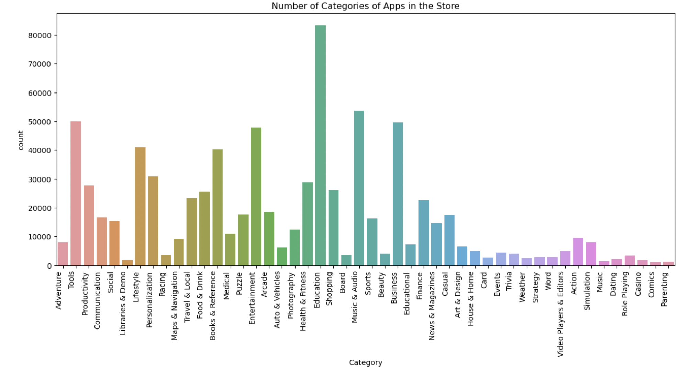
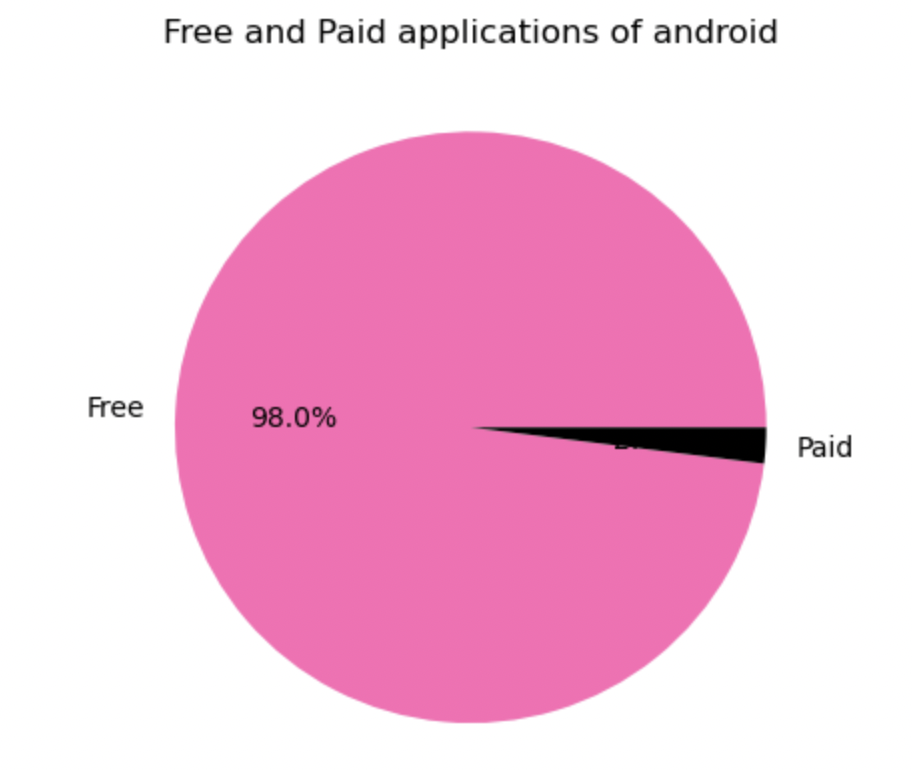

CS625-HW6
================
Syamala Akhila Devi Bolla
2023-03-30

# Homework 6: Project - Initial Dataset Exploration

## Step 1: Choose a Dataset

### Project Details - Android vs iOS Apps

Smartphone usage has increased exponentially in the recent years.
Android and iOS are the most popular smartphone platforms, while the
ease of use along with the computational power to handle a wide array of
applications attracts millions of users worldwide. In this Project we
compare both Android and iOS apps from the App Store and extract the
data of same apps from both Android and iOS and See the difference
between Android and iOS apps in means of Downloads, Size, Ratings,
Customer Reviews, Price etc which gives us user interest on same app.

The objectives of this project are to: \* Clean and Perform exploratory
data analysis on Android and iOS apps dataset.

- Practice data wrangling

- Analyze the android and apple app data to do categorical analysis and
  to determine the relationship between apps rating, reviews and
  downloads.

- Identifying Same apps in both datasets and perform the EDA to
  determine the user intrests on same app.

- Create visualizations that explains our insights on data.

This research has the goal to analyze the android and iOS applications
features together and come up with the market solution to bussiness
developers and app entrepreneurs, which is the succesful app in the
market in both platforms and what are the features helped them to be
successful in the market.

### Datasets

[IOS Dataset](https://github.com/gauthamp10/apple-appstore-apps) (1.2
million data)

Dataset taken through github, they collected the data with the help of
Python and Scrapy running on a cluster of cloud virtual machines. The
data was collected from Apple AppStore on October 2021.

**Description of IOS Dataset:**

We are using a json file “ios.json”. Before getting into Actual EDA, we
will familiarize with the Variables.

- App_Id: This column name represents the application unique Id
- App_Name: This column name represents the application name.
- AppStore_Url: This column name represents the application Store Url.
- Primary_Genre: This coloumn name represents the primary Genre under
  which the application falls.
- Content_Rating: This column name represents the Application content
  rating.
- Size_Bytes: This column name represents the application size (in
  bytes).
- Required_IOS_Version: This column name represents Required IOS version
  of the Application
- Released: This column name represents when the application is released
- Updated: This column name represents when the application is updated
- Version:This column name represents the application current version
- Price: This column name represents the price of the application
- Currency: This column name represents the Currency of the application
- Free: This column name represents whether the application is free or
  not to download
- DeveloperId: This column name represents the DeveloperId of the
  application
- Developer: This column name represents the application Developer name
- Developer_Url: This column name represents the developer Url of the
  application.
- Developer_Website: This column name represents the website of the
  developer of the application
- Average_User_Rating: This column name represents the Average users
  Rating on the application
- Reviews: This column name represents the end users Reviews on
  application
- Current_Version_Score: This column name represents the Current version
  score on the application
- Current_Version_Reviews: This column name represents the end users
  Reviews on current version of the application

[Android
Dataset](https://github.com/gauthamp10/Google-Playstore-Dataset) (2.3
million data)

Dataset taken through github, they collected the data with the help of
Python and Scrapy running on a cluster of cloud virtual machines. The
data was collected from Google play store on June 2021.
<https://github.com/gauthamp10/Google-Playstore-Dataset>

**Description of Android Dataset:**

We are using a csv file “android.csv”. Before getting into actual EDA,
we will familiarize with the variables:-

- App Name - Name of the App
- App Id - Id of the APP
- Category - Category under which the App falls.
- Rating count - Application’s rating on playstore
- Installs - Number of Installs of the App
- Minimum Installs - Maximum Installation Count of the App
- Maximum Installs - Minimum Installation Count of the App
- Free - Boolean (True/False)
- Price - Price of the app (0 if it is Free)
- Reviews - Number of reviews of the App.
- Size - Size of the App.
- Minimum Android - Supported Android Version
- Developer Id - ID of the Developer
- Developer Website - Developer webite
- Developer Email - Developer email is mentioned
- Released - App Release Date
- Last Updated - Date when the App was last updated
- Content Rating - Appropiate Target Audience of the App
- Privacy Policy - Link for the Privacy Policy Agreement
- Ad Supported - Is App is Ad Supported (Boolean)
- In App Purchases - Is App has in app purchases (Boolean)
- Editors Choice - Is app showed in Editors Choice (Boolean)
- Scraped Time - Data Scraped Time

## Step 2: Start the EDA Process for Android Dataset

The total EDA Process in done using Python, Jupyter Notebook is included
in the documents named as **HW6_Notebook.ipynb**.

### Initial Setup

To start the process, loaded the android dataset (android.csv), checked
the data shape and first few lines of data to get idea on the data and
columns present in it.

### Questions

Now we need to ask questions on the data to proceed with data cleaning,
transformation and visualization based on questions.

Question 1: Number of categories of apps in the store and their
respective count.

Question 2: Distribution of free and paid Android applications in terms
of percentage.

We can answer several other questions like Top 5 categories on the basis
of installs and content rating.

### Cleaning and Transformation of Data

- I am going to start with removing unwanted columns like “App Id”,
  “Minimum Installs”, “Maximum Installs”, “Currency”, “Minimum Android”,
  “Developer Id”, “Developer Website”, “Developer Email”, “Released”,
  “Last Updated”, “Privacy Policy”, “Ad Supported”, “In App Purchases”,
  “Editors Choice”, “Scraped Time”, “Rating Count”.

- We can see that there are many NaN (missing) values in our dataset,
  especially in the Rating and rating Count column.

- There are two methods to deal with missing data: Dropping them or
  Imputing them. Depending on the case we can allow a specific
  proportion of missing values, beyond which we might want to drop the
  variable from analysis. But this varies from case to case on the
  amount of information you think the variable has.

- If the information contained in the variable is not that high, you can
  drop the variable if it has more than 50% missing values. There are
  projects / models where imputation of even 20 - 30% missing values
  provided better results.

- We can see that, almost 7913 of the rows have null values in place of
  Ratings. Hence we are taking the mean of the Rating column and filling
  up the null values.

- In case of other variables like, Installs, Size etc, the number of
  null values are too negligible that one can either drop it or fill it.
  I am just using a ‘fillna’ command with forward fill to remove null
  values in the rest of the columns.

- In this way, all the null values have been removed.

### Question 1:

To find the number of categories of apps in the store and their
respective count.

## Bar Chart:

- Idiom Used - Bar Chart

- Marks Used - Line (to encode attributes)

- Channels Used - X-axis, Y-axis and color (to encode attributes)

- Data Attributes, their attribute types, and channels used to encode
  those attributes

1.  Category - Categorical - Horizontal position (X-axis)
2.  Count - Quantative - Vertical Position (Y-axis)
3.  Count - Quantative - Color

- A bar chart is a type of chart that represents data with rectangular
  bars of lengths proportional to the values they represent.

- Bar charts are commonly used to compare and contrast various data
  points across several categories or groupings, such as quantities,
  frequencies, or percentages. The height or length of each bar reflects
  the size of the data being shown, and the bars can be horizontally or
  vertically oriented.

- To further distinguish between various categories or sub-groups, the
  bars can be colored or patterned. Labels or values can be be placed to
  each bar to provide further details.

- From the above bar chart, we can see that the top most category is
  Education followed by Music&Audio, Tools, Business and Entertainment.

### Question 2:

To find the distribution of free and paid Android applications in terms
of percentage.

## Pie Chart

- Idiom Used - Pie Chart

- Marks Used - Sectors (to encode attributes)

- Channels Used - color (to encode percentage values)

- Data Attributes, their attribute types, and channels used to encode
  those attributes

1.  Percentage - Quantative - Color

- A pie chart is a circular graph that represents data as slices of a
  pie.

- Pie charts are commonly used to show the distribution or composition
  of a data set, and can be useful for visualizing proportions,
  percentages, or fractions. However, they can also be misleading if the
  slices are not accurately sized or labeled, or if there are too many
  categories or small values to display effectively.

- In general, pie charts are best suited for displaying data with a
  small number of categories and a clear pattern of distribution.

- From the above pie chart, we can say that free applications of android
  are of 98% and the paid applications of android are of 2%.

## References:

- <https://plotly.com/python/bar-charts/#stacked-bar-chart>

- <https://plotly.com/python/pie-charts/>

- <https://www.markdownguide.org/basic-syntax/>

- <https://www.journaldev.com/33492/pandas-dropna-drop-null-na-values-from-dataframe>

- <https://pandas.pydata.org/docs/reference/api/pandas.DataFrame.fillna.html>
