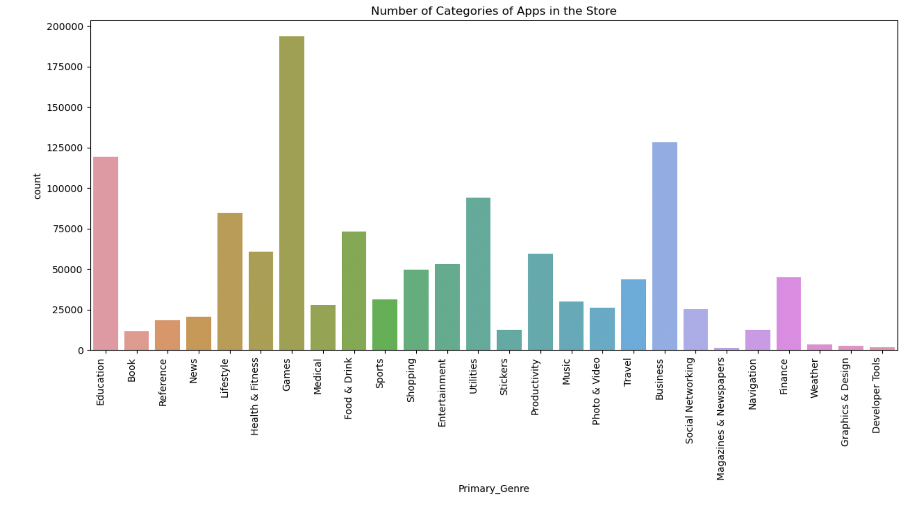
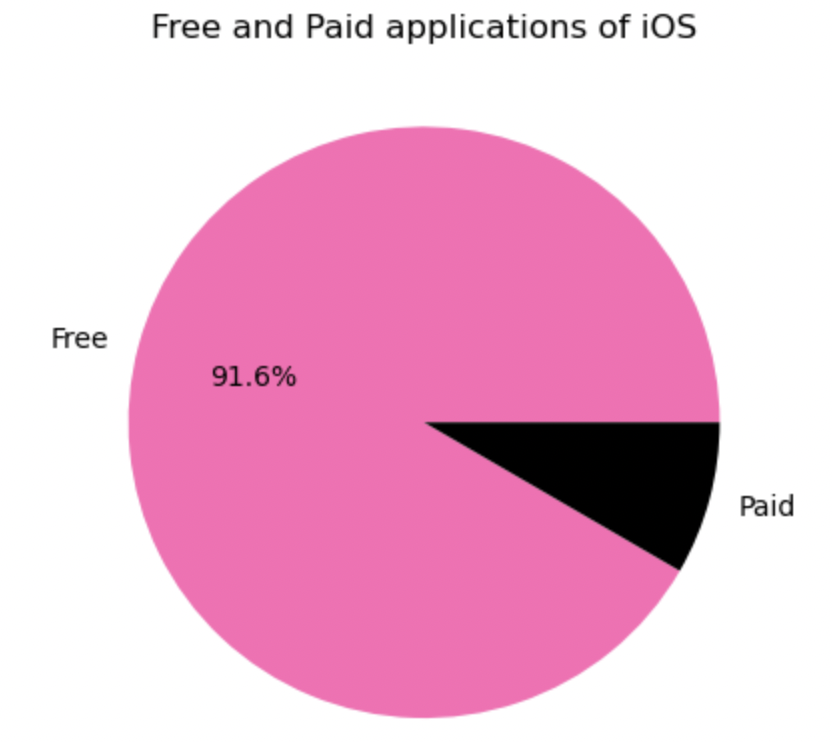
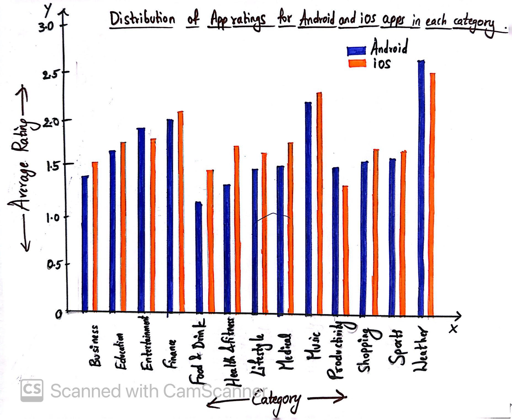
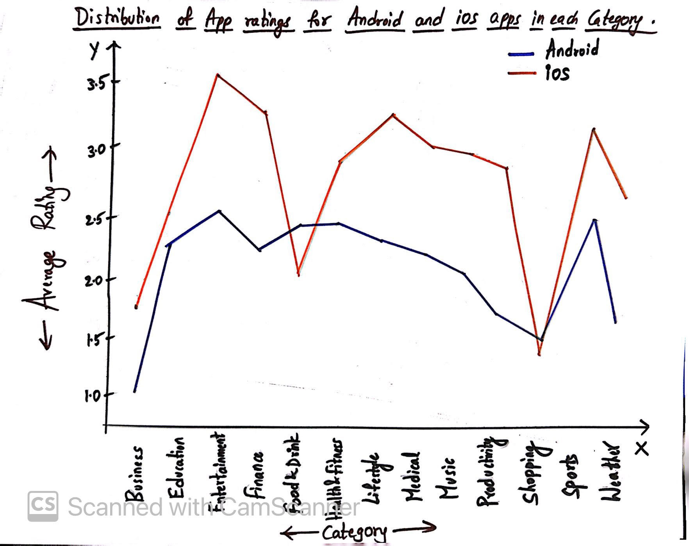
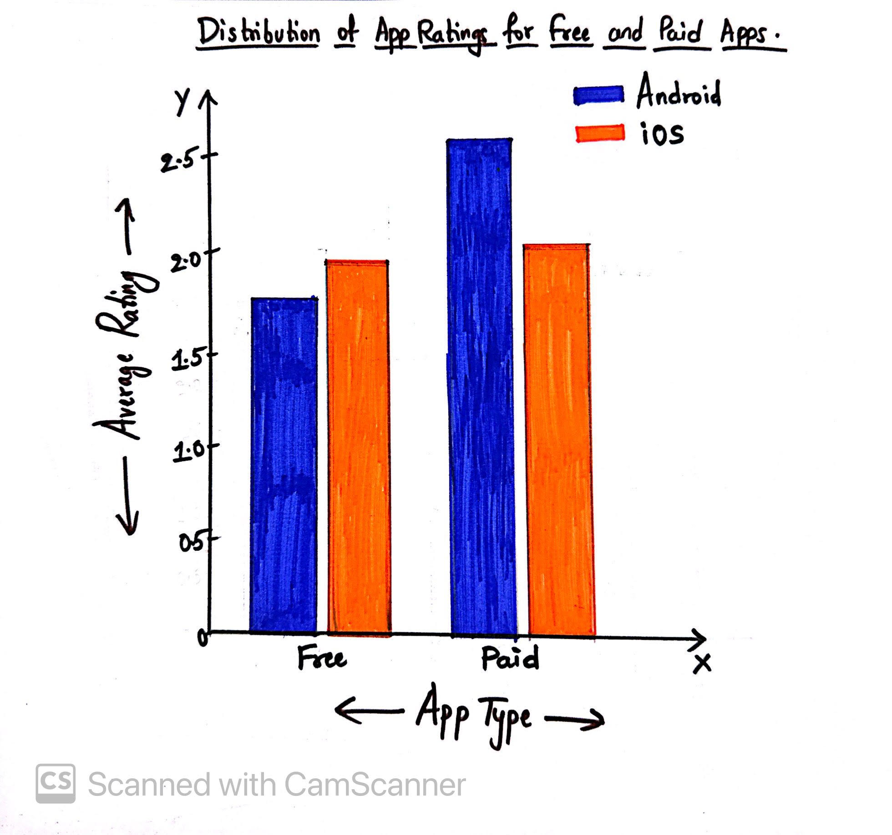
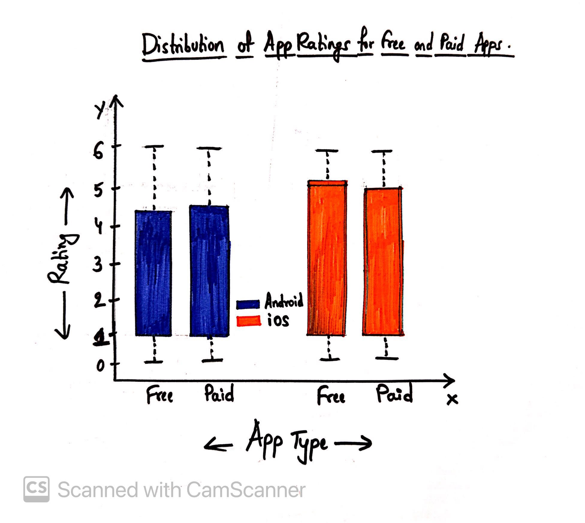

CS625-HW7
================
Syamala Akhila Devi Bolla
2023-04-09

# Homework 7: Project - Generate In-depth Questions using EDA

### Project Details - Android vs iOS Apps

Smartphone usage has increased exponentially in the recent years.
Android and iOS are the most popular smartphone platforms, while the
ease of use along with the computational power to handle a wide array of
applications attracts millions of users worldwide. In this Project we
compare both Android and iOS apps from the App Store and extract the
data of same apps from both Android and iOS and See the difference
between Android and iOS apps in means of Downloads, Size, Ratings,
Customer Reviews, Price etc which gives us user interest on same app.

The objectives of this project are to: \* Clean and Perform exploratory
data analysis on Android and iOS apps dataset.

- Practice data wrangling

- Analyze the android and apple app data to do categorical analysis and
  to determine the relationship between apps rating, reviews and
  downloads.

- Identifying Same apps in both datasets and perform the EDA to
  determine the user intrests on same app.

- Create visualizations that explains our insights on data.

This research has the goal to analyze the android and iOS applications
features together and come up with the market solution to bussiness
developers and app entrepreneurs, which is the succesful app in the
market in both platforms and what are the features helped them to be
successful in the market.

### Datasets

[Android Dataset - First
Dataset](https://github.com/gauthamp10/Google-Playstore-Dataset) (2.3
million data)

Dataset taken through github, they collected the data with the help of
Python and Scrapy running on a cluster of cloud virtual machines. The
data was collected from Google play store on June 2021.
<https://github.com/gauthamp10/Google-Playstore-Dataset>

**Description of Android Dataset:**

We are using a csv file “android.csv”. Before getting into actual EDA,
we will familiarize with the variables:-

- App Name - Name of the App
- App Id - Id of the APP
- Category - Category under which the App falls.
- Rating count - Application’s rating on playstore
- Installs - Number of Installs of the App
- Minimum Installs - Maximum Installation Count of the App
- Maximum Installs - Minimum Installation Count of the App
- Free - Boolean (True/False)
- Price - Price of the app (0 if it is Free)
- Reviews - Number of reviews of the App.
- Size - Size of the App.
- Minimum Android - Supported Android Version
- Developer Id - ID of the Developer
- Developer Website - Developer webite
- Developer Email - Developer email is mentioned
- Released - App Release Date
- Last Updated - Date when the App was last updated
- Content Rating - Appropiate Target Audience of the App
- Privacy Policy - Link for the Privacy Policy Agreement
- Ad Supported - Is App is Ad Supported (Boolean)
- In App Purchases - Is App has in app purchases (Boolean)
- Editors Choice - Is app showed in Editors Choice (Boolean)
- Scraped Time - Data Scraped Time

[IOS Dataset - Second
Dataset](https://github.com/gauthamp10/apple-appstore-apps) (1.2 million
data)

IOS Dataset taken through github, they collected the data with the help
of Python and Scrapy running on a cluster of cloud virtual machines. The
data was collected from Apple AppStore on October 2021.

**Description of IOS Dataset:**

We are using a json file “ios.json”. Before getting into Actual EDA, we
will familiarize with the Variables.

- App_Id: This column name represents the application unique Id
- App_Name: This column name represents the application name.
- AppStore_Url: This column name represents the application Store Url.
- Primary_Genre: This coloumn name represents the primary Genre under
  which the application falls.
- Content_Rating: This column name represents the Application content
  rating.
- Size_Bytes: This column name represents the application size (in
  bytes).
- Required_IOS_Version: This column name represents Required IOS version
  of the Application
- Released: This column name represents when the application is released
- Updated: This column name represents when the application is updated
- Version:This column name represents the application current version
- Price: This column name represents the price of the application
- Currency: This column name represents the Currency of the application
- Free: This column name represents whether the application is free or
  not to download
- DeveloperId: This column name represents the DeveloperId of the
  application
- Developer: This column name represents the application Developer name
- Developer_Url: This column name represents the developer Url of the
  application.
- Developer_Website: This column name represents the website of the
  developer of the application
- Average_User_Rating: This column name represents the Average users
  Rating on the application
- Reviews: This column name represents the end users Reviews on
  application
- Current_Version_Score: This column name represents the Current version
  score on the application
- Current_Version_Reviews: This column name represents the end users
  Reviews on current version of the application

## Exploratory Data Analysis (EDA)

The total EDA Process is done using Python, Jupyter Notebook is included
in the documents named as **HW7_Notebook.ipynb**.

### Data Manipulation or Transformations on the Second Data set

- In order to clean the IOS data, we will check for null values and next
  let’s clean and explore the IOS data to get it into a format for
  analysis.

- Let’s separate the updated and released columns into two different
  columns (Date and Time seperated). Then we will get 4 additional
  columns - ‘Updated_Date’, ‘Updated_Time’, ‘Released_Date’ and
  ‘Released_Time’.

- Next, let’s drop out or remove the unnecessary columns such as
  ‘AppStore_Url’, ‘Updated_Time’, ‘Released_Time’, ‘Released’,
  ‘Updated’, ‘DeveloperId’, ‘Developer_Url’, ‘Developer_Website’,
  ‘Current_Version_Score’, ‘Current_Version_Reviews’, ‘Developer’ and
  ‘Currency’.

- Let’s remove the special characters from the ‘Content Rating Column’.
  This step makes it easier to analyze, clean, and integrate dataset.
  This ios done using Python list comprehension that modifies the values
  in the “Content_Rating” column of a Pandas DataFrame called “df”. More
  specifically, it removes any leading or trailing whitespace characters
  from each value in the “Content_Rating” column using the “strip()”
  method, and replaces any occurrence of the character ‘+’ with an empty
  string using the “replace()” method.

- Next step is to check for null values and it is evident that there are
  no null values in the dataset.

- After checking for the bad data in the dataset, found some bad data
  with ‘Content_Rating’ saying that Not yet Rated. So, removed the row
  with ‘Not yet Rated’ from the ‘Content_Rating’ column.

- Next, Let’s check for the datatypes and covert few categorical
  columns- ‘Content_Rating’, ‘Size_Bytes’, Required_IOS_Verison’,
  ‘Version’, ‘Price’, ‘updated_Date’ and ‘Released_Date’ to numerical.
  “apply()” method is used with a lambda function to convert the values
  in the column to integer or float and assign them to the corresponding
  columns. “pd.to_datetime()” method is used to convert the
  “Updated_Date” and “Released_Date” columns from string to datetime
  format.

- In this way, IOS Dataset has been updated.

### Exploring the Second Dataset

In HW6, firstly I used bar chart to find out the number of categories of
apps in the store and their respective count and found that the top most
category is Education followed by Music&Audio, Tools, Business and
Entertainment. Secondly, I used pie chart to find the distribution of
free and paid android applications in terms of percentage and found that
the free applications of android are of 98% and the paid applications of
android are of 2%. Now, Let’s explore the IOS dataset.

**Find the number of categories of apps in the store and their count.**

- Idiom Used - Bar Chart
- Marks Used - Lines
- Channels Used - X-axis, Y-axis
- Data Attributes, their attribute types and channels used to encode
  these attributes.

1.  Primary_Genre - Categorical - Horizontal position (X-axis)
2.  Count - Quantitative - Vertical Position (Y-axis)

 \* A bar chart is a type of chart that represents data
with rectangular bars of lengths proportional to the values they
represent.

- Bar charts are commonly used to compare and contrast various data
  points across several categories or groupings, such as quantities,
  frequencies, or percentages. The height or length of each bar reflects
  the size of the data being shown, and the bars can be horizontally or
  vertically oriented.

- To further distinguish between various categories or sub-groups, the
  bars can be colored or patterned. Labels or values can be be placed to
  each bar to provide further details.

- From the above bar chart, we can see that the top most category is
  Games followed by Business, Education, Utilities and Lifestyle.

**Find the number of categories of apps in the store and their count.**

- Idiom Used - Pie Chart
- Marks Used - Sectors
- Channels Used - color (to encode attributes)
- Data Attributes, their attribute types and channels used to encode
  these attributes.

1.  Percentage - Quantitative - Color

- A pie chart is a circular graph that represents data as slices of a
  pie.

- Pie charts are commonly used to show the distribution or composition
  of a data set, and can be useful for visualizing proportions,
  percentages, or fractions. However, they can also be misleading if the
  slices are not accurately sized or labeled, or if there are too many
  categories or small values to display effectively.

- In general, pie charts are best suited for displaying data with a
  small number of categories and a clear pattern of distribution.

- From the above pie chart, we can say that free applications of iOS are
  of 91.6% and the paid applications of iOS are of 8.4%.

### Merging the IOS and Android Data

Now that the datasets have been cleaned, it is time to merge the
datasets so that the data exploration and data analysis can be performed
next.

- Merged two datasets based on App_Name. From that we will get list of
  apps available in both android and IOS. The resulting DataFrame, which
  is assigned to “df_3”, will contain all the columns from both “df_1”
  (Android dataframe) and “df_2” (IOS dataframe) where the values in the
  “App_Name” and “App Name” columns match. Therefore, total available
  apps in both datasets are 141524.

- The columns from the merged dataset are ‘App_Id’, ‘App_Name’,
  ‘Primary_Genre’, ‘Content_Rating’, ‘Size_Bytes’,
  ‘Required_IOS_Version’, ‘Version’, ‘Price_x’, ‘Free_x’,
  ‘Average_User_Rating’, ‘Reviews’, ‘Updated_Date’, ‘Released_Date’,
  ‘App Name’, ‘Category’, ‘Rating’, ‘Installs’, ‘Free_y’, ‘Price_y’,
  ‘Size’, ‘Content Rating’, ‘Install1’ and ‘Install’.

- Then found the common categories between the “Category” column and the
  “Primary_Genre” column in the dataframe “df_3”, and keeping only the
  rows that are in common in the both columns to make the visualizations
  look better. We get the categories array of \[‘Lifestyle’, ‘Shopping’,
  ‘Education’, ‘Business’, ‘Medical’, ‘Finance’, ‘Health & Fitness’,
  ‘Productivity’, ‘Sports’, ‘Entertainment’, ‘Food & Drink’, ‘Music’,
  ‘Weather’\].

### Genearting Specific Questions and Propose a Chart:

### Question: 1 - What is the distribution of app ratings for Android and iOS apps in each category?

#### Visualization 1: Bar Chart

This question can be answered using Bar Chart. We can group the ratings
by category for both Android and iOS, get a list of all categories, and
create a bar chart with two bars for each category (one for Android and
one for iOS), with different colors for each bar. The x-axis labels will
be the categories, and the y-axis will be the average rating for each
category.

- Idiom Used - Bar Chart

- Marks Used - Lines

- Channels Used - X-axis, Y-axis and color (to encode categories of iOS
  and Android)

- Data Attributes, their attribute types, and channels used to encode
  those attributes

1.  Category - Categorical - Horizontal position (X-axis)
2.  Average Rating - Quantitative - Vertical Position (Y-axis)
3.  Platform (iOS and Android) - Categorical - Color

The average app rating for each category for both Android and iOS apps
is displayed in the above bar graph. We can see the distribution of app
ratings for Android and iOS apps in each category by comparing the bar
heights for each category. When the bar for Android in a certain
category is higher than the bar for iOS, it means that Android apps in
that category have received higher ratings than iOS apps. In contrast,
if the iOS bar in a given category is higher than the Android bar, it
means that iOS apps in that category have received higher ratings than
Android apps. So, the distribution of app ratings for Android and iOS
apps in each category can be seen using this bar chart and compared.

#### Visualization 2: Line Chart

This question can also be answered using Line Chart. We can plot line
chart on the axis for the mean rating of each category for the Android
and iOS platforms, respectively. The x-axis displays the ‘Category’
names, and the y-axis displays the ‘Average Rating’ values. The Android
line is plotted in blue, and the iOS line is plotted in orange. We can
add labels for the x and y-axes and a legend to the plot.

- Idiom Used - Line Chart

- Marks Used - Lines (Dots)

- Channels Used - X-axis, Y-axis and color (to encode platform - iOS and
  Android)

- Data Attributes, their attribute types, and channels used to encode
  those attributes

1.  Category - Categorical - Horizontal position (X-axis)
2.  Average Rating - Quantitative - Vertical Position (Y-axis)
3.  Platform (Android/iOS) - Categorical - Color

From the above line chart, The average rating of Android and iOS apps
across different categories can be seen as a trend. Between the two
platforms within each category, it clearly compares them. The user may
quickly examine the trends of platforms and determine which has greater
average ratings in each category. This can be useful for determining
which platforms perform better in each category and which categories are
more competitive.

### Question: 2 - To find the distribution of app ratings for free and paid android and iOS apps

#### Visualization 1: Grouped Bar Chart

This question can be answered using grouped bar chart. We can create a
single subplot with four bars, one for each combination of free/paid and
Android/iOS. The bar heights can be set to the mean rating for each
group, and the x-axis labels can be rotated for better readability. The
x-axis displays the ‘App Type’ whether it is free or paid, and the
y-axis displays the ‘Average Rating’ values. The Android bar is plotted
in blue, and the iOS bar is plotted in orange. We can add legend to the
plot.

- Idiom Used - Grouped Bar Chart

- Marks Used - Lines (to encode attributes)

- Channels Used - X-axis, Y-axis and color (to encode attributes)

- Data Attributes, their attribute types, and channels used to encode
  those attributes

1.  App Type - Categorical - Horizontal position (X-axis)
2.  Average Rating - Quantitative - Vertical Position (Y-axis)
3.  Platform (Android/iOS) - Categorical - Color

From the above grouped bar chart, The distribution of app ratings for
free and paid Android and iOS apps can be compared. It enables us to
quickly view the average rating for every app type and platform and to
compare the ratings of other app types. For instance, we can check to
see if paid or free apps often receive higher ratings and if there are
any variations in the rating distributions between Android and iOS apps.

#### Visualization 2: Box Plot

This question can also be answered using Box Plot which can help to
identify the median rating with the help of line inside the box, the
range of ratings with the help of whiskers, and outliers with the help
of circles in the app rating distributions. We can create a boxplot for
free and paid apps for both Android and iOS, and the boxes are colored
with blue indicating android and orange indicating iOS. The x-axis
displays the ‘App Type’ whether it is free or paid, and the y-axis
displays the ‘Rating’ values. We can add the legend with the two box
colors.

- Idiom Used - Box Plot

- Marks Used - Lines, points

- Channels Used - X-axis, Y-axis and color (to encode attributes)

- Data Attributes, their attribute types, and channels used to encode
  those attributes

1.  App Type - Categorical - Horizontal position (X-axis)
2.  Rating - Quantitative - Vertical Position (Y-axis)
3.  Platform (Android/iOS) - Categorical - Color

From the above box plot, The distribution of app ratings for both free
and paid Android and iOS apps can be seen. We can compare the median
ratings for paid and free apps for both Android and iOS by examining the
box plots.

### References

- <https://pandas.pydata.org/docs/user_guide/merging.html>

- <https://plotly.com/python/pie-charts/>

- <https://www.journaldev.com/33492/pandas-dropna-drop-null-na-values-from-dataframe>

- <https://www.geeksforgeeks.org/applying-lambda-functions-to-pandas-dataframe/>

- <https://www.markdownguide.org/basic-syntax/>

- <https://pandas.pydata.org/docs/reference/api/pandas.DataFrame.fillna.html>

- <https://pandas.pydata.org/pandas-docs/version/0.23/generated/pandas.core.groupby.DataFrameGroupBy.agg.html>
